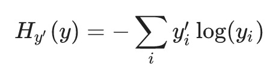

# MNIST in TensorFlow
using softmax regression
& CNNs

---

### Image Input

put an image being falttened into input vector here

---

### Softmax Implementation


+++

### equation form


+++

### matrix form


+++

### defining the model 

```python
x = tf.placeholder(tf.float32, [None, 784])
W = tf.Variable(tf.zeros([784, 10]))
b = tf.Variable(tf.zeros([10]))
y = tf.nn.softmax(tf.matmul(x, W) + b)
```

---

## MNIST with SoftMax


+++?code=mnist_softmax.py&lang=python

@[16-20](tutorial source)
@[21-27](various imports)
@[28-29](load MNIST data)
@[30](load TensorFlow API)
@[32](FLAGS)
@[35-37](import the (one-hot encoded) MNIST data)
@[40-42](create variables, weights, and biases)
@[43](matrix multiplication)
@[46](it gets complicated lol)

---

## Running It

---

## Problem

- rotated characters can be hard to recognize

---

# Additional Info

---

## One-Hot Encoding

- one-hot vectors are 0 in all dimensions but one (which is 1).
- avoids assuming order between categories, as integer encoding (1, 2, 3) does.
- e.x. [1,0,0], [0,1,0], [0,0,1] vs 0, 1, 2

---

## SoftMax (normalized exp(x))

- gives a list of values between 0 and 1 that sum to 1
	- a natural choice for probability
- exponentiates inputs then normalizes for pdf
- [more detailed exploration](http://neuralnetworksanddeeplearning.com/chap3.html#softmax)

---

## Cross-Entropy

- measures how inefficient predictions are at describing the truth
- compares predicted probability distribution to true, one-hot encoded probability vector

+++


for predicted distribution _y_, one-hot vector _y'_

---

## MNIST Dimensionality

