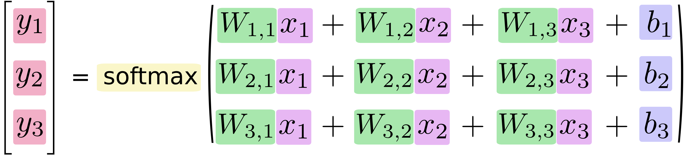

# MNIST with Softmax Regressions
Simpler classification method

---

### MNIST Softmax in TensorFlow


+++

### equation form



+++

### matrix form


+++

### in code

```python
x = tf.placeholder(tf.float32, [None, 784])
W = tf.Variable(tf.zeros([784, 10]))
b = tf.Variable(tf.zeros([10]))
y = tf.nn.softmax(tf.matmul(x, W) + b)
```

---

## Full Code

+++?code=mnist_softmax.py&lang=python

@[30](load TensorFlow API)
@[40-42](variable, weights, and biases)
@[43](matrix multiplication)

---