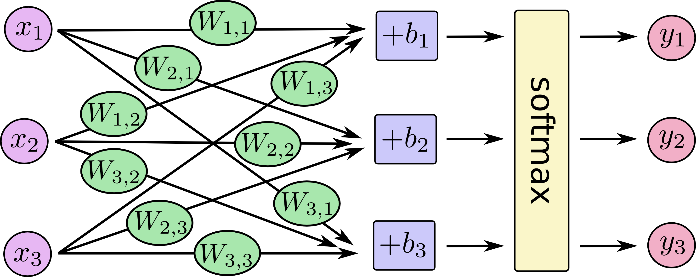

# MNIST in TensorFlow
using softmax regression
& CNNs

---

### Image Input

put an image being falttened into input vector here

---

### Softmax Implementation




+++

### equation form


+++

### matrix form


+++

### defining the model 

```python
x = tf.placeholder(tf.float32, [None, 784])
W = tf.Variable(tf.zeros([784, 10]))
b = tf.Variable(tf.zeros([10]))
y = tf.nn.softmax(tf.matmul(x, W) + b)
```

---

## Full Code


+++?code=mnist_softmax.py&lang=python

@[16-20](tutorial source)
@[21-27](various imports)
@[28-29](load the MNIST data)
@[30](load TensorFlow API)
@[32](FLAGS)
@[35-37](import the MNIST data)
@[40-42](create variables, weights, and biases)
@[43](matrix multiplication)
@[46](it gets complicated lol)

---

## Running It

---

## Problem

- rotated characters can be hard to recognize